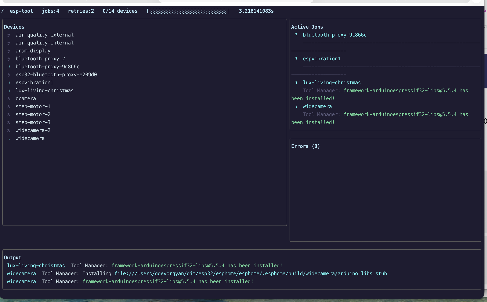
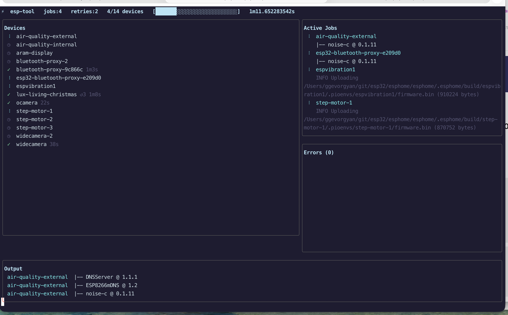
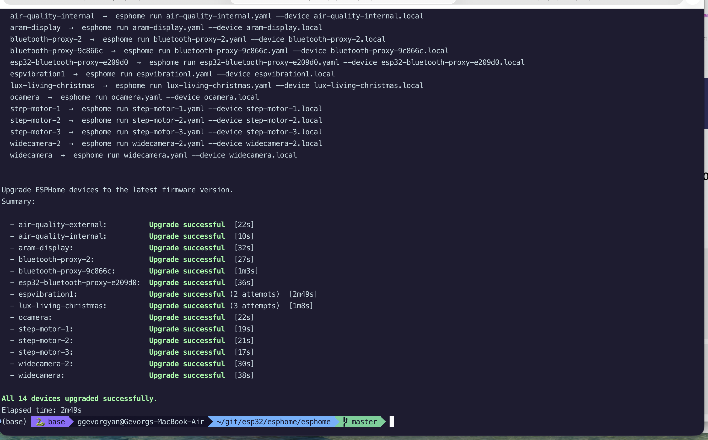

# esp-tool

[](LICENSE)
[](https://go.dev/)
[](https://esphome.io/)

A Go CLI for managing [ESPHome](https://esphome.io) devices. It auto-discovers devices from your ESPHome YAML configuration directory, runs OTA firmware upgrades in parallel with retry logic, and checks running firmware versions — all without maintaining a manual device list.

**Replaces** the handwritten `upgrade-esp-devices.sh` and `check-esp-versions.sh` shell scripts. Adding a new device YAML to your ESPHome repo is all that's needed for it to be picked up automatically.

---

## Screenshots

**TUI — compilation phase** (14 devices, 4 parallel jobs, dependency resolution in progress):



**TUI — upload phase** (progress bar advancing, completed devices marked ✓, active uploads in right panel):



**Post-upgrade summary** (all 14 devices upgraded, retry badges where applicable, per-device timing):



---

## How it works

1. **Discovers devices** by globbing `*.yaml` files in the target directory (skips `secrets.yaml` and subdirectories like `archive/`).
2. **Parses `esphome.name`** from each YAML, resolving ESPHome substitution variables (`${name}`, `$hostname`, etc.) via the `substitutions:` block.
3. **Derives the OTA hostname** as `<name>.local`.
4. **Runs `esphome` commands** in parallel, bounded by a configurable concurrency limit.

---

## Prerequisites

- [Go 1.21+](https://go.dev/dl/) — to build from source
- [`esphome`](https://esphome.io/guides/getting_started_command_line) — must be on your `PATH`

---

## Installation

Clone and build:

```bash
git clone https://github.com/gevgev/esp-tool.git
cd esp-tool
make build          # produces bin/esp-tool
```

Install the binary into your ESPHome YAML directory (so you can run it from there):

```bash
make install                                        # installs to ../esphome/esphome/ by default
make install ESPHOME_DIR=/path/to/your/esphome/dir  # or specify a custom path
```

The installed binary is a build artifact — add it to `.gitignore` in your ESPHome repo:

```
/esp-tool
```

### Shell completion (zsh)

**Option 1 — system-wide (requires sudo):**

```bash
sudo make install-completions
```

**Option 2 — user-local, no sudo.** Add to `~/.zshrc`:

```zsh
fpath=(/path/to/esp-tool/completions $fpath)
autoload -Uz compinit && compinit
```

Then `source ~/.zshrc` (or open a new shell).

Completion covers all subcommands, flags with descriptions, directory path completion for `--dir`, and device name completion for `--filter` (scanned from YAML files in the active `--dir`).

---

## Commands

### `upgrade`

Rebuilds firmware and OTA-flashes all discovered devices. Runs:

```
esphome run <file> --no-logs --device <name>.local
```

Devices are processed in parallel (default: 4 at a time, since compilation is CPU/RAM intensive). On failure, each device is retried up to `--retries` additional times before being marked as failed. A colored summary table is printed when all devices finish.

#### TUI vs plain-text output

When stdout is a TTY at least 80 × 24 characters, the `upgrade` command shows an interactive terminal UI (TUI):

- **Header** — jobs, retries, progress bar (`█░`), elapsed time
- **Left panel** — all devices with live status icons (⠋ running, ✓ success, ✗ failed, ↺ retrying, ◷ queued), retry badge, and final duration
- **Right panels** — active jobs with last output line (top) and error snippets (bottom)
- **Bottom panel** — scrollable tail of the most recent output lines from all devices (or press `?` for help)

When the TUI exits, the same colored summary table as plain mode is printed to stdout.

The TUI is **not** shown when:
- `--plain` or `--no-tui` is passed
- stdout is not a TTY (piped, redirected, CI environment)
- the terminal is smaller than 80 × 24
- (use `--verbose` to see which condition triggered the fallback)

#### TUI keyboard shortcuts

| Key | Action |
|---|---|
| `q` / `ctrl+c` | Quit (auto-exits on all-success; waits for `q` on failure) |
| `?` | Toggle keyboard-shortcut help overlay |
| `↑` / `k` | Scroll device list up |
| `↓` / `j` | Scroll device list down |
| `Home` / `g` | Jump to top of device list |
| `End` / `G` | Jump to bottom of device list |

**Flags:**

| Flag | Short | Default | Description |
|---|---|---|---|
| `--dir` | `-d` | `.` (cwd) | Directory containing ESPHome YAML files |
| `--jobs` | `-j` | `4` | Maximum simultaneous `esphome` processes |
| `--retries` | `-r` | `2` | Retry attempts after the first failure |
| `--retry-delay` | | `5s` | Wait time between retry attempts |
| `--timeout` | | `0` (none) | Per-attempt timeout; kills the process if exceeded (e.g. `10m`) |
| `--filter` | | | Comma-separated device names to upgrade (all if omitted) |
| `--dry-run` | | `false` | Print commands without executing them |
| `--prefix` | | `true` | Prefix live output lines with `[device-name]` (plain mode) |
| `--plain` | | `false` | Disable TUI; use plain-text output |
| `--no-tui` | | `false` | Alias for `--plain` |
| `--log-file` | | | Append all device output to a file (streamed line-by-line) |
| `--verbose` | `-v` | `false` | Print diagnostic logs to stderr (retries, timing, TUI fallback reason) |

**Examples:**

```bash
# Upgrade all devices from the current directory (esphome repo root)
./esp-tool upgrade

# Upgrade from a specific directory
esp-tool upgrade --dir ~/git/esp32/esphome/esphome

# Increase parallelism and retries
esp-tool upgrade --jobs 6 --retries 3

# Use a longer pause between retries (e.g. device is slow to reboot)
esp-tool upgrade --retry-delay 15s

# Upgrade only specific devices (comma-separated)
esp-tool upgrade --filter lux-living-christmas
esp-tool upgrade --filter step-motor-1,step-motor-2

# Dry-run: verify device discovery and see exact commands without flashing
esp-tool upgrade --dry-run

# Force plain-text output (no TUI) — useful in scripts or over SSH
esp-tool upgrade --plain

# Stream all output to a file while TUI is active
esp-tool upgrade --log-file /tmp/upgrade-$(date +%Y%m%d).log

# Show why TUI was not activated (runs in plain mode in this example)
esp-tool upgrade --verbose 2>&1 | head -3

# Combine: dry-run a filtered set from a specific directory
esp-tool upgrade --dir ~/git/esp32/esphome/esphome --filter ocamera --dry-run

# Kill any attempt that takes longer than 10 minutes (prevents stuck OTA from blocking a slot)
esp-tool upgrade --timeout 10m
```

**Sample output:** see the [Screenshots](#screenshots) section at the top of this README.

---

### `validate`

Runs `esphome config <file>` for every discovered device in parallel. Reports which configs are valid and which have errors, **without compiling or flashing anything**. Use this as a pre-flight check after editing YAML before a batch upgrade.

Compile errors detected here also cause `upgrade` to skip retries automatically — if a device's config is broken, `upgrade` reports `Upgrade failed (compile error)` and moves on immediately rather than retrying.

**Flags:**

| Flag | Short | Default | Description |
|---|---|---|---|
| `--dir` | `-d` | `.` (cwd) | Directory containing ESPHome YAML files |
| `--jobs` | `-j` | `0` (all) | Maximum simultaneous `esphome` processes |
| `--timeout` | | `30s` | Per-device timeout for config validation |
| `--filter` | | | Comma-separated device names to check (all if omitted) |
| `--dry-run` | | `false` | Print commands without executing them |
| `--verbose` | `-v` | `false` | Print diagnostic logs to stderr |

**Examples:**

```bash
# Validate all devices in the current directory
esp-tool validate

# Validate from a specific directory
esp-tool validate --dir ~/git/esp32/esphome/esphome

# Validate a single device
esp-tool validate --filter lux-living-christmas

# Dry-run: see what would be checked
esp-tool validate --dry-run
```

---

### `versions`

Connects to each device's live log stream in parallel, grabs the first `ESPHome version` line, and exits. Prints a colored summary. Times out per device after `--timeout` (default 12 s).

**Flags:**

| Flag | Short | Default | Description |
|---|---|---|---|
| `--dir` | `-d` | `.` (cwd) | Directory containing ESPHome YAML files |
| `--timeout` | | `12s` | Per-device timeout before marking unreachable |
| `--filter` | | | Comma-separated device names to check (all if omitted) |

**Examples:**

```bash
# Check all devices from the current directory
./esp-tool versions

# Check from a specific directory
esp-tool versions --dir ~/git/esp32/esphome/esphome

# Allow more time for slow devices
esp-tool versions --timeout 20s

# Check only a subset of devices
esp-tool versions --filter ocamera,widecamera,widecamera-2
```

**Sample output:**

```
Checking firmware versions for 14 devices...

ESPHome device firmware versions.
Summary:

  - air-quality-external:          v2024.11.0
  - air-quality-internal:          v2024.11.0
  - aram-display:                  v2024.11.0
  - bluetooth-proxy-2:             v2024.11.0
  - bluetooth-proxy-9c866c:        Unreachable
  ...

13 reachable, 1 unreachable
Elapsed time: 12s
```

---

### `diagnostics`

Connects to each device's live log stream in parallel, collects the initial boot dump, and prints a per-device health table. Times out per device after `--timeout` (default 15 s).

Detects:
- Crash on previous boot (hardware WDT, exception, etc.)
- Bootloader too old for OTA rollback (needs one-time USB flash)
- Bootloader supports SRAM1 (+40 KB IRAM, opt-in flag available)
- Chip rev ≥ 3.0 (binary size can be reduced with `minimum_chip_revision`)
- GPIO strapping pin in use
- Multiple OTA platform configs merged

**Flags:**

| Flag | Short | Default | Description |
|---|---|---|---|
| `--dir` | `-d` | `.` (cwd) | Directory containing ESPHome YAML files |
| `--timeout` | | `15s` | Per-device timeout for log collection |
| `--filter` | | | Comma-separated device names to check (all if omitted) |
| `--reboot` | `-r` | `false` | Soft-reboot each device before capturing logs |
| `--reboot-wait` | | `12s` | Time to wait after rebooting before collecting logs |
| `--verbose` | `-v` | `false` | Print diagnostic logs to stderr |

**Examples:**

```bash
# Check all devices from the current directory
./esp-tool diagnostics

# Check from a specific directory
esp-tool diagnostics --dir ~/git/esp32/esphome/esphome

# Check a subset with verbose output
esp-tool diagnostics --filter espvibration1,lux-living-christmas --verbose

# Reboot each device first to capture a fresh boot log
esp-tool diagnostics --reboot
```

---

## Typical workflow

After a new ESPHome version is released:

```bash
# 1. Upgrade the esphome tool itself
pip3 install esphome --upgrade

# 2. (Optional) Validate all device configs before touching any hardware
./esp-tool validate

# 3. (Optional) Verify all devices are currently reachable
./esp-tool versions

# 4. Upgrade all devices
./esp-tool upgrade

# 5. If any failed, retry just those
./esp-tool upgrade --filter bluetooth-proxy-9c866c
```

---

## Project structure

```
esp-tool/
├── cmd/esp-tool/main.go          # CLI entry point (cobra commands, flag wiring)
├── internal/
│   ├── diagnostics/              # Boot log collection and health analysis
│   ├── discovery/scanner.go      # YAML glob, esphome.name parsing, substitution resolution
│   ├── output/                   # OutputWriter abstraction (PlainWriter, MutexWriter, ShouldUseTUI)
│   ├── tui/                      # Bubbletea TUI — model, panel renderers, TUIWriter
│   ├── upgrader/runner.go        # Parallel esphome execution, semaphore, retry logic
│   └── report/printer.go        # Colored ANSI summary table
├── completions/
│   └── _esp-tool                 # Zsh completion script
├── go.mod
├── Makefile
└── README.md
```
